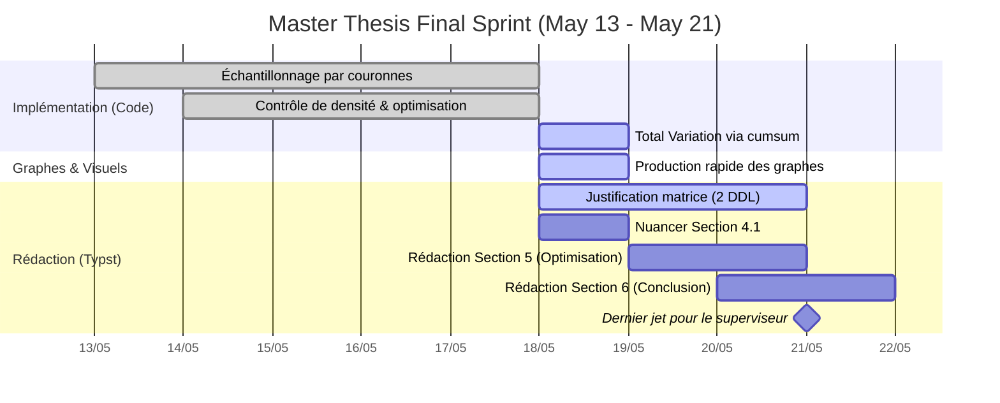

# 🚀 Final Sprint Dashboard (May 11 - May 21)

Ce dashboard retrace la route pour le rendu du dernier jet du mémoire prévu le **Jeudi 21 mai 2026 à 14h30**.

## 📅 Timeline (Gantt)

## ✅ Todo List Subdivisée

### 1. Implémentation & Expériences (Code)
- [x] #task Mettre à jour l'échantillonnage de la section 4.1 : utiliser des couronnes concentriques (boule $L_\infty$) autour de $A_\delta$. ⏫ 📅 2026-05-14
- [x] #task Implémenter le contrôle de densité : s'assurer d'avoir un nombre homogène de matrices par couronne. ⏫ 📅 2026-05-14
- [ ] #task Optimiser l'évaluation temporelle avec la fonction `cumsum`. 🔼 📅 2026-05-18
- [ ] #task Tracer l'évolution temporelle de la *Total Variation* sur une trajectoire unique et l'agréger. ⏫ 📅 2026-05-18

### 2. Visualisation & Figures (Graphes)
- [ ] #task Remplacer le Boxplot (Figure 2) par un Bar plot / Min plot (affichant moyenne et variance). ⏫ 📅 2026-05-18
- [ ] #task Produire les graphes finaux : variance des 10 % dernières itérations et *Total Variation*. 🔼 📅 2026-05-18

### 3. Réflexion Théorique & Rédaction (`Master_Thesis.typ`)
- [ ] #task **(PRIORITÉ MAJEURE)** Justifier la matrice paramétrique personnelle et démontrer mathématiquement la réduction à 2 degrés de liberté. ⏫ 📅 2026-05-21
- [ ] #task Nuancer la conclusion de l'exploration aléatoire (Section 4.1) : limiter le chaos à une anomalie locale. ⏫ 📅 2026-05-18
- [ ] #task Rédiger la Section 5 (Optimisation) : intégrer le modèle et les expériences OMWU/OGDA. ⏫ 📅 2026-05-20
- [ ] #task Rédiger la Section 6 (Conclusion). 🔼 📅 2026-05-21

## 💡 Notes de l'appel du 11 mai 2026
* **Lemme 5 vs $A_{\lambda, \gamma}$** : Julien Grand-Clément préfère la paramétrisation du Lemme 5 ($A_{sep}$) car une matrice de jeu $2 \times 2$ n'a mathématiquement que 2 degrés de liberté (invariance par translation et multiplication scalaire positive). -> **Mise à jour 18 mai :** Modélisation et démonstration d'une matrice paramétrique propre pour retrouver ces 2 DDL.
* **Nuance Section 4.1** : Ne pas généraliser le chaos à l'ensemble du simplexe, ce phénomène reste concentré localement autour de la région de $A_\delta$.
